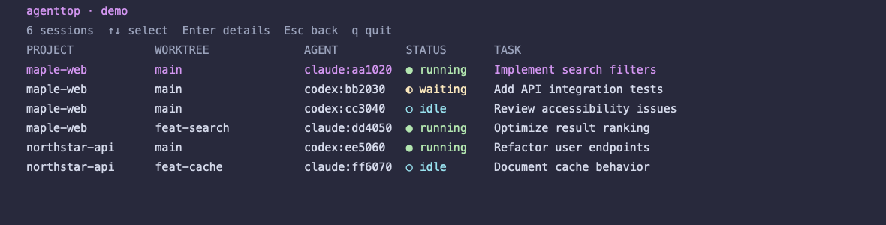

# agenttop

Claude Code と Codex のローカルセッションを Git worktree ごとに表示する TypeScript + Ink のプロトタイプです。macOS と Node.js 22 以上を対象にします。



```sh
pnpm install
pnpm build
node dist/cli.js setup
node dist/cli.js doctor
node dist/cli.js
```

`setup` は `~/.claude/settings.json` と `~/.codex/hooks.json` にユーザー単位の hook を追加し、既存ファイルのバックアップを `.agenttop.bak` に作ります。Codex が hook の信頼確認を表示した場合は内容を確認してください。ビルド済み CLI のパスを設定するため、このリポジトリを移動した場合はビルドと `setup` を再実行してください。

hook はプロンプト全文やツール引数を保存せず、イベント種別、セッション ID、作業ディレクトリ、依頼文の抜粋（最大160文字）を `/tmp/agenttop-<UID>/events.jsonl` に記録します。Codex のワークスペース制限下でも書き込めるようにするためです。`AGENTTOP_DATA_DIR` で保存先を変更できます。TUI が閉じていても hook の記録は続きます。`/tmp` は OS の清掃や再起動で消える場合があります。

Codex は追加した hook を個別に信頼するまで実行しません。Codex 内で `/hooks` を開き、agenttop の各 hook を確認して信頼してください。hook 設定の追加前から開いているセッションでは、新しいセッションを開始して確認してください。

起動時には直近24時間に更新されたローカル履歴も探索します。履歴だけで見つかったセッションの状態は `unknown` です。`running` や `waiting_permission` が5分間更新されなければ、表示状態を `unknown` にします。現在のプロトタイプは履歴の一覧と詳細表示までです。

一覧の `TASK` は hook が取得したユーザー依頼文を最大160文字に整形して表示します。短い相づちでは直前のタスク名を維持します。hook 導入前のセッションは Codex の履歴プレビューまたは Claude Code の最初の依頼文を使います。画面幅に応じて省略し、Enter の詳細画面で保存した範囲を確認できます。同じ provider のセッションは `codex:abcdef` のように ID 末尾6文字で区別します。依頼文の抜粋はイベント JSONL に保存されるため、機密情報を含む依頼文を使う場合は保存先の扱いに注意してください。

開発時は `pnpm dev`、確認は `pnpm typecheck && pnpm test && pnpm build` を使用します。
